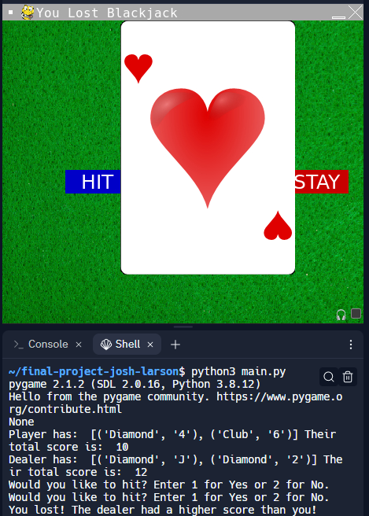
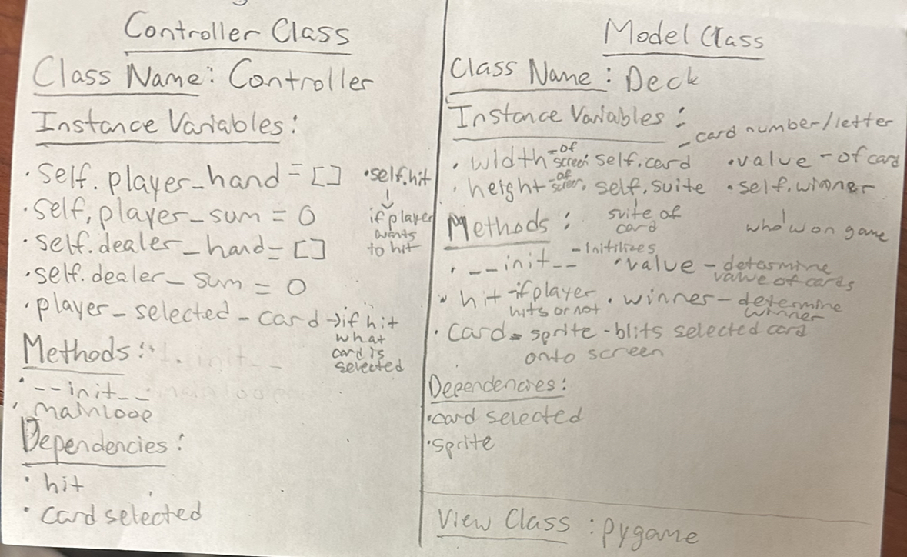

# CS110 Project Proposal
# Josh & Larson Project ("Blackjack")
## CS 110 Final Project
### Fall, 2022
### [Assignment Description](https://docs.google.com/document/d/1H4R6yLL7som1lglyXWZ04RvTp_RvRFCCBn6sqv-82ps/edit?usp=sharing)

https://replit.com/join/pbdwjvgvsq-joshuajanason

<< [(https://docs.google.com/presentation/d/1Hf52rKw3B3q6SAW1IQDcKc4AvDdJKeMdzax6UCySmAU/edit#slide=id.p)](#) >>

### Team: Josh & Larson 
#### Joshua Janason & Richard Larson

***

## Project Description

Our project is based on the in real life card game blackjack. The game follows the standard rules of blackjack with the 52 cards found in a typical playing deck. A deck is formed and begins to deal cards to two players: a dealer and a player which interacts with the program. The total values of the two cards are given and like traditional blackjack, the players is asked if they would like to hit(add another card to their hand) or stay. After, the total scores are calculated and whoever gets 21 wins, whoever gets over 21 loses, and if lower than 21, whoever has the higher score between the two win. 

***    

## User Interface Design

- **Initial Concept**
  - There is only one screen in the program. The title screen shows up as "Blackjack" when the game starts but changes at the end based on who wins the game. Additionally, the background image is a green playing table as if it were an actual game of blackjack. There are two buttons which decides whether the players stays or hits. There is also a card which is popped up which is based on the new card that is dealt if the player hits. 
    
    
- **Final GUI**
  -  * An example of the game at the end.

***        

## Program Design

* Non-Standard libraries
    * None. Only used pygame and random.
* Class Interface Design
    * 
   *  
* Classes
    *  
Class Deck:
-x(int): the horizontal position of the deck
-y(int): the vertical position of the deck
-amount(int): the amount of cards in the deck (can be updated)
-card: the card that is selected at the time
-list: a list of all of the possible cards in the deck (52 cards in total)
-image: the image of the deck (just cards facing down)
-FUNCTION: shuffle: the deck is able to shuffle through the cards randomly to create a new order
-FUNCTION: deal: the deck is able to hand out a card to the player and the dealer (removes the card from the deck)

Class Card: 
-x(int): the horizontal position of the card (changes if it is dealt to either the player or the dealer)
-y(int): the vertical position of the card (changes if it is dealt to either the player or the dealer)
-value(int): the value of the card
-FUNCTION: move: the card is able to move in any direction at a certain speed

Class Player:
-name("str"): the player's name
-points("int"): the amount of points (in card value) that the player has
-cards("str"): the specific cards that the player has in hand
-result("str"): the result if the player wins or loses
-x(int): the horizontal position of the player
-y(int): the vertical position of the player

## Project Structure and File List

The Project is broken down into the following file structure:

* main.py
* src
    *  deck.py, sample_controller.py
* assets
    * card_images, background.jpeg, class_diagram.jpg, logo.png) 
* etc
    * milestone2.py 

***

## Tasks and Responsibilities 

   * Joshua Janason: README.me, Interface Design Image, deck class: __init__ , value, hit, winner, card_sprite, gametest functions, controller class: __init__ , mainloop, called all functions and made it run through main.py. 
   * Richard Larson: Added the card images and background image to assets, Made the blue and red rectangles with the "hit" and "stay", worked on ATP.

## Testing

*  The testing strategy for this project was to put print statements whenever a result would be expected from the code and it would print into the terminal. From there, it could be concluded whether or not the code worked how it was supposed to. Additionally, to test the overall game, we used a gameTest() function to run the whole program and ensure it worked from beginning to end with no errors.

## ATP

| Step                 |Procedure             |Expected Results                   |
|----------------------|:--------------------:|----------------------------------:|
|  1         | Open terminal, navigate to folder ~/final-project-josh-larson$ , and type, “python3 main.py” in the terminal         |A green colored screen will appear with the title "Blackjack" as well as a blue button that says hit and a red button that says stay.|
|  2                   |Within the shell of the program, the user will be told the cards in the dealers hand and their own hand. The user will then be given the question "Would you like to hit?" as an input statement.      |The exact value of both the dealer and player hands will be shown with the exact cards in their hands. 
| 3| If the card is an ace, an input statment will be entered in the terminal asking if the player would like the card to be worth 1 or 11. | The player will enter which value of the ace they want and this value will be added to their hand.| 
| 4|The player can enter the number "1" for hit or "2" for stay into the terminal and if they want to hit then they will be given another card to ther deck. If the user recieves a card that keeps the player's points lower than 21, the user can once again hit or stay. The user will again decide to hit or stay.|In the terminal, the result of whether or not the user hit or stayed will be shown as well as their new card. The new card will be added and printed along with the deck as well as the new value.
|5|The game is over. | The title of the game will change to the result of who won and there will be a message sent into the terminal saying if the player or dealer won with their respective hand values. 

